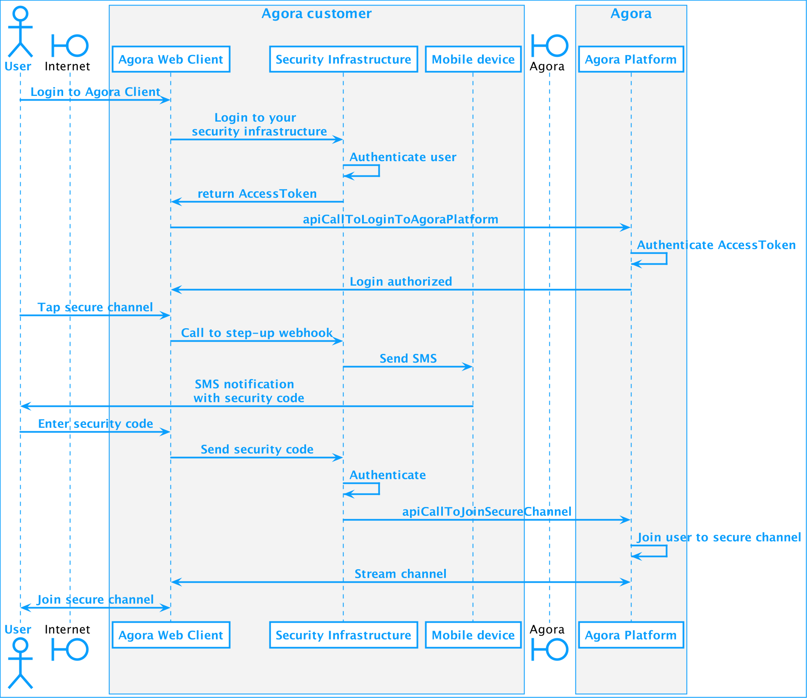

This template applies to documents aiming at finishing a certain task, for example, a quickstart guide, basic features, and advanced features.

> The title describes a task that you want to do. For example: **Implement step-up authentication**.
> For docs published on dev portal, the doc title is configured in the internal cms.
> To write a page, use the style and tone suggest in the style guide.

# Title

> Explain why the content is relevant and what the user will achieve.
> Use "page" at the top of a document and "section" wherever else.
> For example:

Step-up authentication provides a higher level of assurance that a person is who they claim to be. When a user tries to perform a task, they are challenged to produce additional forms of authentication. In this case, when a user who is already logged into your Agora client tries to connect to a highly secure conference, the back-end system sends a one-time sms-code to a registered mobile device which the user enters in your Agora Client.

This page shows you how to add this functionality to you Agora Client and security infrastructure. 

## Understand the tech

> A helicopter view that explains the architecture and workflow that the user is implementing.
> 
> For example:

To *achieve the task outlined in the Title* you use *these technologies* that *work in the following way*.

>Add an architecture diagram, workflow diagram, animation, screenshot here.
> 
> For example:

The following figure shows the callflow between the different elements you use to implement step-up-authentication for Agoras:


> Add a concise but complete explanation of the task. Where needed, link to a trusted source.


## Prerequisites

> List what the reader needs to know, as well as packages or SDKS that must be available, to successfully work through the tutorial. Keep the list short, but be sure to include language and concepts the reader should be familiar with.
> 
> **IMPORTANT**: The first prerequisite will always include a link to the _“Before Getting Started”_ tutorial using URL: https://docs.agora.io/en/Agora%20Platform/get_appid_token?platform=All%20Platforms.
> 
> For example:


To successfully understand and complete this task you must have the following:

- A valid [Agora account](https://docs.agora.io/en/Agora%20Platform/sign_in_and_sign_up). If you don't have an account, see how to [Get started with Agoras](https://www.agora.io/en/blog/how-to-get-started-with-agora?utm_source=medium&utm_medium=blog&utm_campaign=PAGE_TITLE).
  > The URL to the setup the Agora account is made up of _URL_:_PAGE_TITLE_. 
  > For a blog named _How to Build a Token Server for Agora Applications using GoLang_ the link is: https://www.agora.io/en/blog/how-to-get-started-with-agora?utm_source=medium&utm_medium=blog&utm_campaign=How_to_Build_a_Token_Server_for_Agora_Applications_using_GoLang
  > 
  > It's imperative that you type this URL correctly as it will be the primary way Agora can properly track developer conversion from individual content posts.
- An Agora project with the [app certificate](https://docs.agora.io/en/Agora%20Platform/manage_projects?platform=All%20Platforms#manage-your-app-certificates) enabled.  
- Good knowledge of [Multi-factor authentication](https://en.wikipedia.org/wiki/Multi-factor_authentication).


## Project setup 

> Describe the steps to create a new project and set up the environment. For example,
> - Create a xxx project
> - Necessary configurations
> - Create the UI
>
> **IF NONE ARE NEEDED, REMOVE THIS SECTION**
> 
> For example:

To create the environment necessary to **TITLE OF THIS PAGE**:

1. Do this.
1. Do that.
1. Do something else.

> Markup commands to run in the terminal as ```code```.
> 
> If you need a specific file structure, do it as a text diagram:
> For example: 
> 
> <environment_root> \
> ├── index.html \
> ├── scripts \
> │ └── script.js \
> └── styles \
> │ └── style.css

## Build \<A rewording of the page title>

> The title for the steps does not have to be "Build".

> If there are multiple logical sections in the procedure such as back-end and frond-end, use subsections. The goal is to modularize the various elements and build the project in a logical way that makes it easy for the user to follow along.
> 
> Write an intro sentence to explain the subsections:
> 
> For example:

Step-up authentication implementation involves changes to components in your Agora Client and security infrastructure. This section shows you how to:

- [Build \<module1 in procedure>](link to module1)
- [Build \<module2 in procedure>](link to module2)

> If there are no locical subsections, write a single procedure here.

### Build \<module1 in procedure> 

> A module explains how to implement a set of functions that operate together to produce a specific feature of the project. 
> Be sure to explain all inputs and outputs (not necessarity a complete API reference), discuss their significance within the code and how they work together.
> 
> For DevRel writings, all code snippets should use: 
> - Blog or Medium - GitHub Gists. if the code is only a snippet make sure to denote that in the file name following the format: `functionName+snippet.fileExtension`. For example if my function name is generateToken and its a javascript snippet, the Gist would have the title: `generateToken+snippet.js`. If the code within the Gist is an entire file or set of functions that can be copied and pasted and will work on their own as a library or project, name the Gist after the file they would represent with the repository.
> - Dev.to or any markdown file - within code blocks:
> 
        > ```javascript 
        > code blocks 
        > Always remember to put the coding language 
        > ```
    >
> For example:

To add step-up-authentication to your Agora client:

1. Do this.
1. Do that:
   1. Sometimes you need substeps.
   1. Always at least 2 substeps.  
1. Do something else.

### Build \<module2 in procedure>

> Brief explanation about what the technology does in this section, then a procedure.
> 
> For example:

To add step-up-authentication to your security infrastructure:

1. Do this.
1. Do that:
    1. Sometimes you need substeps.
    1. Always at least 2 substeps.
1. Do something else.


## Test \<A rewording of the page title>

To ensure that you have implemented \<A rewording of the page title> correctly:

1. Do this.
1. Do that:
    1. Sometimes you need substeps.
    1. Always at least 2 substeps.
1. Do something else.

## Next steps

Write a short paragraph in conclusion. At the end of the paragraph, please include a link to the completed source code on GitHub.  

> Always include a section at the end of each post that includes links to the relevant Agora Documentation and Advanced Guides.

Your next steps after implementing this functionality are:

1. Read the following documentation:
    1. Very good document about something useful.
   1. Another very good document about something useful.
1. Join the Agora.io Developer Slack community.
1. Something else. 

## Reference

> If there is reference information you want to share with the user, add it here. If not, remove this section. 
> 
> For example:

You use the following to configure or develop \<TITLE>:

| Name        | Default           | Type  | Description |
| ------------- |:-------------:| -----:| :-----|
| shakespeare     | playwright | job | Set `shakespeare` to `poet` to enable the sonnet writing functionality for this instance.  Possible values are: <ul><li>`actor` - someone who pretends to be someone else while performing in a film, play, or television or radio programme.</li><li>`director` - a person who is in charge of a film or play and tells the actors how to play their parts.</li><li> `impresario` - a person who arranges different types of public entertainment, such as theatre, musical, and dance events.</li><li> `playwright` - a person who writes plays.</li><li> `poet` - a person who writes poems.</li></uls>
|You| get|the | idea |